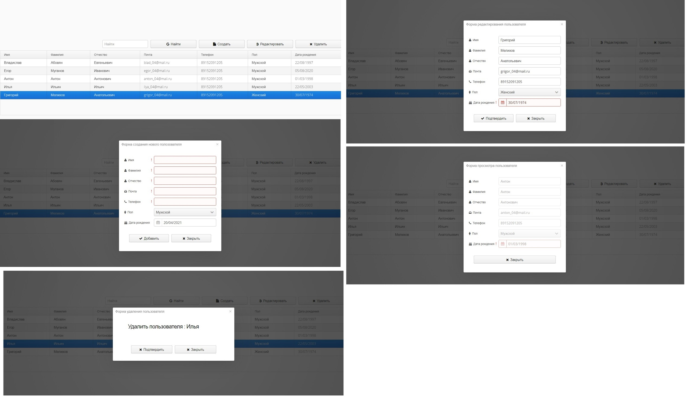

app
==============

Template for a simple Vaadin application that only requires a Servlet 3.0 container to run.

Workflow
========

To compile the entire project, run "mvn install".

To run the application, run "mvn jetty:run" and open http://localhost:8080/ .

To produce a deployable production mode WAR:
- change productionMode to true in the servlet class configuration (nested in the UI class)
- run "mvn clean package"
- test the war file with "mvn jetty:run-war"

CRUD веб приложение, созданное на фреймворке [Vaadin](https://vaadin.com "Ссылка на сайт фреймворка").
Главное меню приложения представляет собой таблицу наполненную данными.
Функционал приложения, просмотр выбранной записи, редактирование выбранной записи и удаление выбранной записи, создание новой записи.
Есть возможность фильтрации данных в таблице.
При создании и редактировании записи ко всем полям подключена валидация данных.

